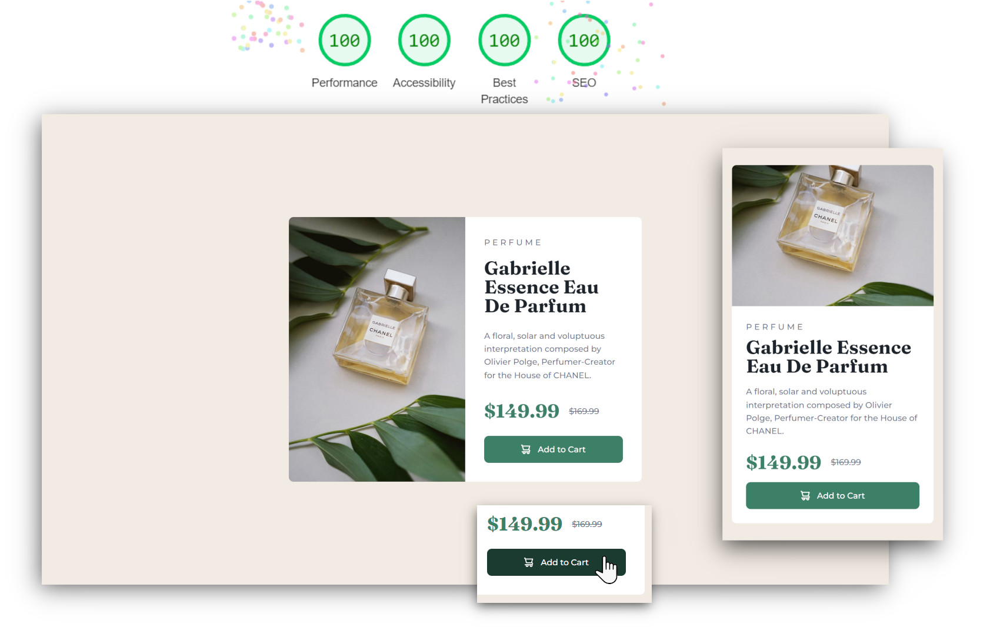

# Frontend Mentor - Product preview card component solution



This is a solution to the [Product preview card component challenge on Frontend Mentor](https://www.frontendmentor.io/challenges/product-preview-card-component-GO7UmttRfa). Frontend Mentor challenges help you improve your coding skills by building realistic projects.

## Table of contents

- [Overview](#overview)
  - [The challenge](#the-challenge)
  - [Links](#links)
- [My process](#my-process)
  - [Built with](#built-with)
  - [What I learned](#what-i-learned)
- [Author](#author)

## Overview

### The challenge

Users should be able to:

- View the optimal layout depending on their device's screen size
- See hover and focus states for interactive elements

### Links

- Solution URL: [frontendmentor.io](https://www.frontendmentor.io/solutions/responsive-component-written-in-html-and-css-SrL100S2q9)
- Live Site URL: [https://mateusabelli.github.io/product-preview-card-component/](https://mateusabelli.github.io/product-preview-card-component/)

## My process

### Built with

- HTML 5
- CSS 3
  - Custom properties
  - Flexbox
  - CSS Grid
  - Mobile-first workflow

### What I learned

In this project I learned how to change the image source through CSS using the content property. I also practiced writing better alt texts for images.

```html

```

```css
.card-image > img {
  content: url("./images/image-product-desktop.jpg");
}
```

## Author

- Website - [github.com/mateusabelli](https://github.com/mateusabelli)
- Frontend Mentor - [@mateusabelli](https://www.frontendmentor.io/profile/mateusabelli)
